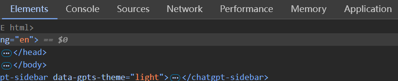
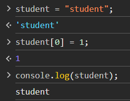
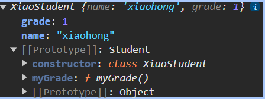
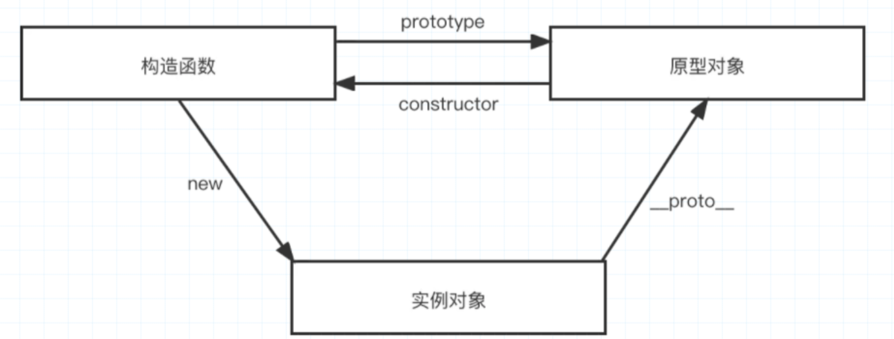
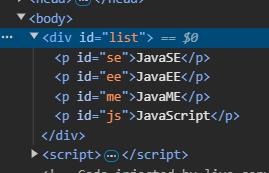
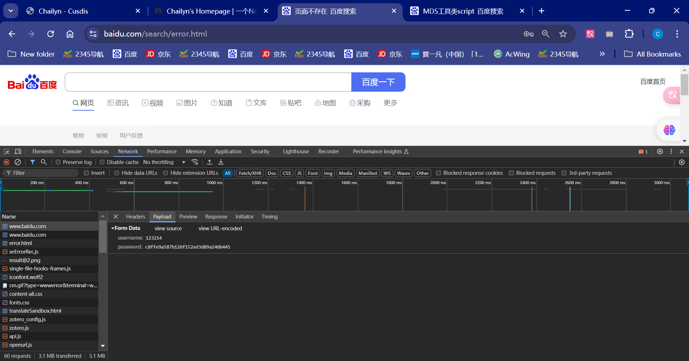
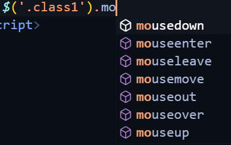
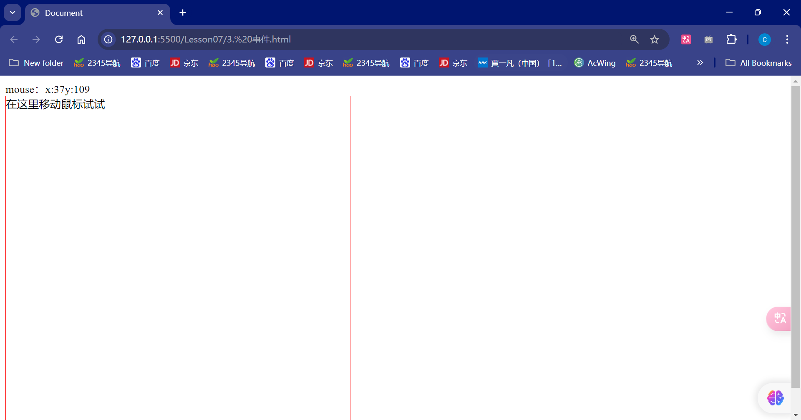

### 1、什么是JavaScript

------

#### 1.1 概述

JavaScript是一门世界上最流行的脚本语言

#### 1.2 历史

ECMAScript可以理解成JavaScript的一个标准

### 2、快速入门

------

#### 2.1 引入JavaScript

1、内部标签

```html
<script>
    //......
</script>
```


2、外部引用

abs.js

```javascript
//......
```

test.html

```html
<script src="abs.js">
</script>
```

#### 2.2 基本语法入门

```html
<script>
        // 1. 定义变量 变量名称 变量名 = 变量值
        var num = 1;
        var score = 71;
        // alert(num);
        // 2. 条件控制
        if(score>60 && score<70){
            alert("60~70");
        }else if(score>70 && score<80){
            alert("70~80");
        }else{
            alert("other");
        }
        //console.log(score) 在浏览器的控制台打印变量！ System.out.println();
</script>
```

浏览器必备调试



#### 2.3 数据类型

数据，文本，图形，音频，视频......

==变量==

变量名称 变量名 = 变量值

==number==

js不区分小数和整数，Number

```javascript
123 //整数123
123.1 // 浮点数
1.123e3// 科学计数法
-99 // 复数
NaN //not a number
Infinity //表示无限大
```

==字符串==

'abc' "abc"

==布尔值==

true , false

==逻辑运算==

```
&& 两个为真，结果为真
|| 一个为真，结果为真
! 真即假 假即真
```

==比较运算符==

```
= 赋值
== 等于（类型不一样，值一样，结果为true） 1=='1'
=== 绝对等于（类型一样，值一样，结果为true）
```

这是JS的一个缺陷，坚持不要用==比较

须知：

- NaN===NaN，这个与所有的数值都不相等，包括自己
- 只能通过 isNaN(NaN) 来判断这个数是否是NaN


浮点数的问题

```javascript
console.log((1/3)===(1-2/3))
```

尽量避免使用浮点数进行运算，存在精度问题！

```javascript
console.log(Math.abs(1/3-(1-2/3))<0.00000001);
```

==null 和 undefined==

- null 空
- undefined 未定义

==数组==

Java中必须是一系列相同类型的对象，JS中不需要这样,各种类型都可以放一块

```javascript
//保证代码的可读性，尽量使用[ ]
var arr=[1,2,3,4,5,'hello',null,true]
new Array(1,2,3,4,5,'hello',null,true)
```

区数组下标：如果越界了，就会

```
undefined
```

==对象==

对象是大括号，数组是中括号

> 每个属性之间使用逗号隔开，最后一个不需要添加

```javascript
var person={
            name:"xinjiang",
            age:3,
            tags:['js','java','web','...']
        }
```

取对象的值

```html
> person.age
< 3
> person.name
< 'xinjiang'
```

#### 2.4 严格检查格式

```html
<!DOCTYPE html>
<html lang="en">
<head>
    <meta charset="UTF-8">
    <meta name="viewport" content="width=device-width, initial-scale=1.0">
    <title>Document</title>
    <!-- 
    前提：IEDA 需要设置支持ES6语法
    'use strict';严格检查模式，预防JavaScript的随意性导致的一些问题 
    必须写在JavaScript第一行
     局部变量建议都是用let定义
    -->
    <script>
        'use strict';
        // 全局变量
        let i = 1;
        // ES6  let
    </script>
</head>
<body>
    
</body>
</html>
```

### 3、数据类型

------

#### 3.1 字符串

1、正常字符串我们使用单引号，或者双引号包裹

2、注意转义字符 \ 

```
\' '
\n 换行
\t table
\u4e2d 中 \u#### Unicode字符
\x41 ASCll字符
```

3、多行字符串编写

```javascript
// tab 上面，esc 下面
var msg = `hello
        world
        你好呀
        你好 `
```

4、模版字符串

```javascript
let name = "xinjiang";
let age = 3;
let msg=`您好呀，${name}`
```

5、字符串长度

```
str.length
```

6、字符串的可变性，不可变



7、大小写转换

```javascript
//注意这里是方法不是属性
student.toUpperCase()
student.toLowerCase()
```

8、student.indexOf('t')

9、截取字符

**substring**

```java
[)
student.substring(1);// 从第二个字符到最后一个字符 tudent
student.substring(1,3);// tu
```

#### 3.2 数组

**Array可以包含任意的数据类型**

```javascript
var arr = [1,2,3,4,5,6]
arr[0]
arr[0] = 1
```

1、长度

```javascript
arr.length
```

注意：加入给arr.length 赋值，数组大小就会发生变化，如果赋值过小，元素就会丢失

2、indexOf，通过元素获得下标索引

```javascript
arr.indexOf(2)
1
```

字符串的"1"和数字 1 是不同的

3、slice()  截取Array的一部分，返回一个新的数组，类似于String中的substring

4、**push() pop()**

```javascript
push: 压入尾部
pop: 弹出尾部的一个元素
```

5、**unshift() shift() 头部**

```javascript
unshift: 压入头部
shift: 弹出头部的一个元素
```

6、排序 sort()

```javascript
["B","C","A"]
arr.sort()
["A","B","C"]
```

7、元素反转 reverse()

```javascript
["A","B","C"]
arr.reverse()
["C","B","A"]
```

8、**concat()**

```javascript
["C","B","A"]
arr.concat([1,2,3])
["C","B","A",1,2,3]
arr
["C","B","A"]
```

注意： concat() 并没有修改数组，只是会返回一个新的数组

9、连接符 join

打印拼接数组，使用特定的字符串连接

```javascript
["C","B","A"]
arr.join('-')
"C-B-A"
```

10、多维数组

```javascript
arr = [[1,2],[3,4],["5","6"]];
arr[1][1]
4
```

数组：存储数据（如何存，如何取，方法都可以自己实现！）

#### 3.3 对象

若干个键值对

```javascript
var 对象名 = {
    属性名:  属性值,
    属性名:  属性值,
    属性名:  属性值,
    属性名:  属性值
}
//定义了一个person对象，它有四个属性
var person = {
            name:"kuangshen",
            age:3,
            email:"chailyn@163.com",
            score: 0
        }
```

JS中的对象，{.......}表示一个对象，键值对描述属性xxxx: xxxx，多个属性之间使用逗号隔开，最后一个属性不加逗号！

JavaScript的所有的键都是字符串，值是任意对象

1、对象赋值

```javascript
person.name = "qingjiang"
"qingjiang"
person.name
"qingjiang"
```

2、使用一个不存在的对象属性，不会报错！

```javascript
person.haha
undefined
```

3、动态的删减属性

```javascript
delete person.name
true
person 里面就没有name了
```

4、动态的添加，直接给新的属性

```javascript
person.haha = "haha"
"haha"
person 里面多了haha属性
```

5、判断属性值是否在这个对象中！ xxx in xxx!

```javascript
'age' in person
true
//继承
'toString' in person
true
```

6、判断一个属性是否是这个对象自身拥有的 hasOwnProperty()

```javascript
person.hasOwnProperty('toString')
falsek
person.hasOwnProperty('age')
true
```

#### 3.4 流程控制

if判断

```javascript
var age = 3;
if(age>3){
	alert("haha");
}else{
	alert("kuwa");
}
```

while循环，**避免程序死循环**

```javascript
while(age<100){
	age = age +1 ;
	console.log(age);
}
do{
	age = age +1 ;
	console.log(age);
}while(age<100)
```

for循环

```javascript
for(let i = 0; i<100;i++){
   console.log(i);
}
```

forEach循环

> 5.1 引入

```javascript
var age = [12,3,12,12,3,12,3,12,3,]
    //函数
    age.forEach(function (value){
        console.log(value)
    })
```

for..in

```javascript
for(var num in age){
     if(age.hasOwnProperty(num)){
          console.log("存在")
     }
         console.log(age[num]);
    }
```

#### 3.5 Map和Set

map

```javascript
//学生的成绩，学生的名字
// var names = ["Tom","Jack","haha"];
// var scores = [100,90,80]
var map = new Map([['Tom',80],['Jack',90],['Chailyn',100]]);
var name = map.get('Tom');
map.set('admin',100);
map.delete("Tom");
console.log(name);
```

Set：无序不重复集合

```javascript
var set = new Set([1,1,1,1,3]);//Set可以去重
set.add(2);
set.delete(2);
console.log(set.has(3));
```

#### 3.6 iterator

> es6 新特性

通过for of实现遍历，for in 遍历下标

```javascript
var arr = [3,4,5];
for(let x of arr){
    console.log(x);
}
```

遍历map

```javascript
var map = new Map([['Tom',80],['Jack',90],['Chailyn',100]]);
for(let x of map){
    console.log(x);
}
```

遍历set

```javascript
var set = new Set([1,2,3]);
for(let x of set){
    console.log(x);
}
```

### 4、函数

------

#### 4.1 定义函数

```javascript
public 返回值类型 方法名(){
    return 返回值；
}
```

> 定义方法一

绝对值函数

```javascript
function abs(x){
    if(x>=0){
        return x;
    }else{
        return -x;
    }
}
```

一旦执行到 return 代表函数的结束，返回结果！

如果没有执行return，函数执行也会返回结果，结果就是undefined

> 定义方法二

```javascript
var abs = function(x){
    if(x>=0){
        return x;
    }else{
        return -x;
    }
}
```

这是一个匿名函数，但是可以把结果赋值给abs，通过abs就可以调用函数！

方法一和方法二等价

> 调用函数

```javascript
abs(10) //10
abs(-10) //10
```

参数问题：JavaScript可以传任意一个参数，也可以不传递参数

参数进来是否存在问题？

假设不存在参数，如何规避？

```javascript
function abs(x){
    //手动抛出异常
    if(typeof x!== "number"){
        throw 'Not a number';
    }
    if(x>=0){
        return x;
    }else{
        return -x;
    }
}
```

> arguments

`arguments`是一个JS免费赠送的关键字；

代表，传递进来的所有的参数，是一个数组

```javascript
var abs = function(x){
    console.log("x=>"+x);
    for(var i = 0;i<arguments.length;i++){
        console.log(arguments[i]);
    }

    if(x>=0){
        return x;
    }else{
        return -x;
    }
}
```

问题：arguments 包含所有的参数，我们有时候使用多余的参数来进行附加操作，需要排除已有的参数

> rest

ES6引入的新特性，获取除了已经定义的参数之外的所有参数...

```javascript
function aaa(a,b,...rest){
    console.log("a=>"+a);
    console.log("b=>"+b);
    console.log(rest);
}
```

rest参数只能写在最后面，必须用...标识。

#### 4.2 变量的作用域

在JavaScript中，var定义的变量实际是有作用域的。

假设在函数体中声明，则在函数体外不可以使用~（非要实现的话，研究下`闭包`）

```javascript
function qj(){
    var x = 1;
    x = x + 1;
}
x = x + 2;//Uncaught ReferenceError: x is not defined
```

如果两个函数使用了相同的变量名，只要在函数内部，就不冲突

```javascript
function qj(){
    var x = 1;
    x = x + 1;
}
function qj2(){
    var x = 'A';
    x = x + 1;
}
```

假设，内部函数变量和外部函数变量，重名！

```javascript
function qj(){
    var x = 1;
    x = x + 1;
    function qj2(){
        var x = 'A';
        console.log('inner'+x);
    }
    console.log('outer'+x);
    qj2();
}
qj();
```

```
outer2
innerA
```

假设在JavaScript中函数查找变量从自身函数开始，由内向外查找，假设外部存在这个同名的函数变量，则内部函数会屏蔽外部函数的遍历变量

> 提升变量的作用域

```javascript
function qj(){
    var x = "x" + y;
    console.log(x);
    var y = 'y';
}
```

结果：xundefined

说明：js执行引擎，自动提升了y的声明，但是不会提升变量y的赋值；

```javascript
function qj2(){
    //var x,y,z...
    x = "x" + y;
    console.log(x);
    y = 'y';
}
```

这个实在JavaScript建立之初就存在的特性。养成规范：所有的变量定义都放在函数的头部，不要乱放，便于代码的维护；

```javascript
function qj2(){
   var x = 1,
       y = x + 1,
       z,i,a;
}
```

> 全局函数

```javascript
x = 1;
function f(){
    console.log(x);
}
console.log(x);
```

全局对象 window 

```javascript
var x = 'xxx';
alert(x);
alert(window.x);// 默认所有的全局变量，都会自动绑定子啊window对象之下
```

alert( ) 本身也是一个`window`的变量

```javascript
var x = 'xxx';
window.alert(x);
var old_alert = window.alert;
old_alert(x);
window.alert = function(){

}
//失效了
window.alert(123);
//恢复
window.alert = old_alert;
window.alert(456);
```

Javascript 实际上只有一个全局作用域，任何变量（函数也可以视为变量），假设没有在函数作用范围内找到，就会向外查找，如果在全局作用于都没有找到，报错`ReferenceError`

> 规范

由于我们所有的全局变量都会绑定到我们的window上，如果不同的js文件，使用了相同的全局变量，冲突->如何能够减少冲突

```javascript
//唯一全局变量
var kuangapp = {};
//定义全局遍历那个
kuangapp.name = 'kuangshen';
kuangapp.add = function(a,b){
    return a + b;
}
```

把自己的代码全部放入自己定义的唯一的空间名字中，降低命名冲突的问题

jQuery

> 局部作用域 let

```javascript
function aaa(){
    for(var i = 0;i<100;i++){
        console.log(i);
    }
    console.log(i+1);//i出了作用域还可以使用
}
```

ES6 let关键字，解决局部作用域冲突问题！

```javascript
function aaa(){
    for(let i = 0;i<100;i++){
        console.log(i);
    }
    console.log(i+1);//i is not defined
}
```

> 常量const

在ES6之前，怎么定义常量；只有用全部大写字母命名的变量就是常量；建议不要修改值

```javascript
var PI = '3.14';
console.log(PI);
PI = '123';//可以改变这个值
console.log(PI)
```

在ES6 引入了常量关键字 `const`

```javascript
const PI = '3.14';
console.log(PI);
PI = '123';//Assignment to constant variable.
```

#### 4.3 方法

> 定义方法

方法就是把函数放在对象的里面，对象只有两个东西：属性和方法

```javascript
var kuangshen = {
    name:'chailyn',
    birth:2002,
    age:function(){
        var now = new Date().getFullYear();
        return now - this.birth;
    }
}
//属性
kuangshen.name
//方法，调用方法一定带()
kuangshen.age()
```

this.代表什么？拆开上面的代码看看~

```javascript
function getAge(){
    var now = new Date().getFullYear();
    return now - this.birth;
}
var kuangshen = {
    name:'chailyn',
    birth:2002,
    age:getAge
}

//kuangshen.age() 22
//getAge() NaN window
```

this是无法指向的，是默认只想调用它的那个对象

> apply

在JavaScript中可以控制this指向

```javascript
function getAge(){
    var now = new Date().getFullYear();
    return now - this.birth;
}
var kuangshen = {
    name:'chailyn',
    birth:2002,
    age:getAge
}

//kuangshen.age() 22
//getAge() NaN window
getAge.apply(kuangshen,[])//this,指向了kuangshen,参数为空
```

### 5、内部对象

------

> 标准对象

```javascript
typeof 123
'number'
typeof '123'
'string'
typeof true
'boolean'
typeof NaN
'number'
typeof []
'object'
typeof{}
'object'
typeof Math.abs
'function'
typeof undefined
'undefined'
```

#### 5.1 Date

基本使用

```javascript
now.getMonth();//月 0~11 代表月
now.getDate();//日
now.getDay();//星期几
now.getHours();//时
now.getMinutes();//分
now.getSeconds();//秒

now.getTime();//时间戳 全世界统一 1970 1.1 0：00：00 毫秒数
console.log(new Date(1726744217123))//时间戳变成时间
```

转换

```javascript
now = new Date(1726744217123)//Thu Sep 19 2024 19:10:17 GMT+0800 (China Standard Time)
now.toLocaleString()//'9/19/2024, 7:10:17 PM'
now.toGMTString()//'Thu, 19 Sep 2024 11:10:17 GMT'
```

#### 5.2 JSON

> json是什么

早期，所有的数据传输习惯使用XML文件

- JSON是一种轻量级的数据交换格式
- 其简洁和清晰的层次结构有效地提升了网络[传输效率](https://baike.baidu.com/item/传输效率/7856651?fromModule=lemma_inlink)，使其成为理想的数据交换语言。其文件通常使用扩展名.json。
- 它易于人阅读和编写，同时也易于机器解析和生成

在JavaScript一切皆为对象、任何JS支持的类型都可以用JSON来表示：

格式：

- 对象都用{}
- 数组都用[]
- 所有的键值对都使用key:value

JSON字符串和JS对象的转化

```javascript
var user = {
    name:"chailyn",
    age:22,
    sex:'女'
}
//对象转化为json字符串
var jsonUser = JSON.stringify(user)

//json 字符串转化为对象,参数为json字符串
var obj = JSON.parse('{"name":"chailyn","age":22,"sex":"女"}')
```

很多人搞不清楚，JSON和JS对象的区别

```javascript
var obj = {a:'hello',b:'hellob'};
var json = '{"a":"hello","b":"hellob"}'
```


#### 5.3 Ajax

- 原生的JS写法 xhr 异步请求
- jQuey 封装好的 方法 $("#name").ajax("") 
- axios 请求

### 6、面向对象编程

------

> 原型对象

JavaScript、Java、C#...面向对象；javascript有些区别

- 类：模板

- 对象：具体实例

在JavaScript这个需要自己转换下思维方式！

- 原型：

  ```javascript
  var User = {
              name:"chailyn",
              age:22,
              run:function(){
                  console.log(this.name+" run...");
              }
          }
          
          var xiaoming = {
              name:"xiaoming"
          }
  
          // 小明的原型是User
          xiaoming.__proto__ = User;
  
          var Bird = {
              fly:function(){
                  console.log(this.name+" fly...");
              }
          }
  
          // 小明的原型是Bird
          xiaoming.__proto__ = Bird;
  ```

```javascript
function Student(name){
    this.name = name;

}
Student.prototype.hello = function(){
    alert('Hello')
}
```

> class 继承

`class`关键字，是在ES6引入的

1、定义一个类，属性，方法

```javascript
class Student{
    constructor(name){
        this.name = name;
    }
    hello(){
        alert('hello')
    }
}
var xiaoming = new Student("xiaoming");
xiaoming.hello()
```

2、继承

```javascript
class Student{
    constructor(name){
        this.name = name;
    }
    hello(){
        alert('hello')
    }
}
class XiaoStudent extends Student{
    constructor(name,grade){
        super(name);
        this.grade = grade;
    }
    myGrade(){
        alert('我是一名小学生')
    }
}
var xiaoming = new Student("xiaoming");
var xiaohong = new XiaoStudent("xiaohong",1)
```

本质：查看对象原型



> 原型链

__ proto__:

### 7、操作BOM对象（重点）

------

> 浏览器介绍

JavaScript和浏览器的关系？

JavaScript的诞生就是为了能够让他在浏览器中运行！

BOM：浏览器对象模型

- IE 6~11
- Chrome
- Safari
- FireFox 

**三方**

- QQ浏览器
- 360浏览器

> window

window 代表 浏览器窗口

```javascript
window.alert(1)
undefined
window.innerHeight
136
window.innerWidth
1163
window.outerHeight
672
window.outerWidth
1280
```

> Navigator

Navigator，封装了浏览器的信息

```javascript
navigator.appName
'Netscape'
navigator.appVersion
'5.0 (Windows NT 10.0; Win64; x64) AppleWebKit/537.36 (KHTML, like Gecko) Chrome/127.0.0.0 Safari/537.36'
navigator.userAgent
'Mozilla/5.0 (Windows NT 10.0; Win64; x64) AppleWebKit/537.36 (KHTML, like Gecko) Chrome/127.0.0.0 Safari/537.36'
navigator.platform
'Win32'
```

大多数时候，我们不会使用`navigator`对象，因为会被人为修改！

不建议使用这些属性来判断和编写代码

> screen

代表屏幕尺寸

```javascript
screen.width
1280
screen.height
720
```

> location（重要）

location 代表当前页面的URL信息

```javascript
host: "www.baidu.com"
href: "https://www.baidu.com/?tn=15007414_20_dg"
protocol: "https:"
reload: ƒ reload()//网页刷新
//设置新的地址
location.assign('https://own.chailyncui.blog/')
```

> document

document 代表当前的页面，HTML DOM文件树

```javascript
document.title
'百度一下，你就知道'
document.title = 'Chailyn'
'Chailyn'
```

获取具体的文档树节点

```html
<dl id="app">
    <dt>Java</dt>
    <dd>JavaSE</dd>
    <dd>JavaEE</dd>
</dl>
<script>
    var dl = document.getElementById('app')
</script>
```

获取 cookie

```javascript
document.cookie
"__guid=111872193829123821791839127329128..."
```

劫持 cookie 原理

www.taobao.com

```html
<script src = "aa.js"></script>
<!--恶意人员：获取你的cookie上传到他的服务器-->
```

服务器端可以设置cookie：httpOnly

> history

history 代表浏览器的历史记录

```javascript
history.back()//后退
history.forward()//前进
```

### 8、操作DOM对象（重点）

------

DOM：文档对象模型

> 核心

浏览器网页就是一个DOM树形结构！

- 更新：更新DOM节点
- 遍历DOM节点：得到DOM节点

- 删除：删除一个DOM节点
- 添加：添加一个DOM节点
- 要操作一个DOM节点，就必须要获得这个DOM节点

> 获得DOM节点

```javascript
// 对应CSS选择器
document.getElementsByTagName('h1');
document.getElementById('p1');
document.getElementsByClassName('p2');
var father = document.getElementById('father');
var children = father.children;//获取父节点下的所有子节点
// father.firstChild
// father.lastChild
```

这是原生代码，之后我们尽量都是用jQuery

>更新节点

操作文本

- `id1.innerText = '456'`修改文本的值
- `id1.innerHTML = '<strong>123</strong>'`可以解析HTML文本标签

操作JS

```javascript
id1.style.fontSize = '200px';// - 转 驼峰命名问题
id1.style.color = 'red';
id1.style.padding = '2em';
```

> 删除节点

删除节点的步骤：先获取父节点，在通过父节点删除自己

```html
<div id="father">
        <h1>标题1</h1>
        <p id = "p1">p1</p>
        <p class="p2">p2</p>
    </div>

<script>
    var self = document.getElementById('p1');
    var father = p1.parentElement;
    father.removeChild(p1)
    
    // 删除是一个动态的过程
    father.removeChild(father.children[0]);
    father.removeChild(father.children[1]);
    father.removeChild(father.children[2]);
</script>
```

注意：删除多个节点的时候，children是在时刻变化的，删除节点的时候一定要注意

> 插入节点

我们获得了某个DOM节点，假设这个DOM节点是空的，我们通过innerHTML就可以增加一个元素了，但是这个DOM节点已经存在元素了，我们就不能这么干了！会产生覆盖

追加

```html
<p id = 'js'>JavaScript</p>
<div id="list">
    <p id="se">JavaSE</p>
    <p id="ee">JavaEE</p>
    <p id="me">JavaME</p>
</div>

<script>
    var js = document.getElementById('js');
    var list = document.getElementById('list');
    list.appendChild(js);// 追加到后面
</script>
```

效果：



>创建一个新的标签，实现插入

```html
<!--<p id = "newP">Hello</p>-->
<p id = 'js'>JavaScript</p>
<div id="list">
    <p id="se">JavaSE</p>
    <p id="ee">JavaEE</p>
    <p id="me">JavaME</p>
</div>

<script>
    var js = document.getElementById('js');// 已经存在的结点
    var list = document.getElementById('list');
    //通过JS 创建一个新的结点
    var newP = document.createElement('p');//创建一个p标签
    newP.id = 'newP';
    newP.innerText = 'Hello';
    list.appendChild(newP);

    // 创建一个标签节点（通过这个属性，可以设置任意的值）
    var myScript = document.createElement('script');
    myScript.setAttribute('type','text/javascript');
</script>
```

> insert

```javascript
var ee = document.getElementById('ee');
var js = document.getElementById('js');
var list = document.getElementById('list');
// list节点是父节点，insertBefore(newNode,targetNode)
list.insertBefore(js,ee);
```

### 9、操作表单（验证）

------


> 表单是什么 form DOM树

- 文本框 text
- 下拉框 < select >
- 单选框 radio
- 多选框 checkbox
- 隐藏框 hidden
- 密码框 password
- ......

表单的目的：提交的信息

> 获得提交的信息

```html
<form action="post">
    <p>
        <span>用户名：</span><input type="text" id="username">
    </p>
    <!-- 多选框的值，就是定义好的value -->
    <p>
        <span>性别：</span>
        <input type="radio" name="sex" value="man" id="boy">男
        <input type="radio" name="sex" value="woman" id="girl">女
    </p>
</form>
<script>
    var input_text = document.getElementById('username');
    var boy_radio = document.getElementById('boy');
    var girl_radio = document.getElementById('girl');
    // 得到输入框的值 ：input_text.value
    // 修改输入框的值
    input_text.value = '123'

    // 对于单选框，多选框等等固定的值，用value只能选到当前的值
    boy_radio.checked;// 查看返回的结果，是否为true，则被选中
    boy_radio.checked = false;//
</script>
```

> 提交表单

```html
<head>
    <meta charset="UTF-8">
    <meta name="viewport" content="width=device-width, initial-scale=1.0">
    <!-- MD5工具类 -->
    <script src="https://cdn.bootcss.com/blueimp-md5/2.10.0/js/md5.min.js"></script>
    <title>Document</title>
</head>
<body>
    <!-- 表单绑定提交时间 onsubmit = 绑定一个提交检测的函数，true，false
     将这个结果返回给表单，使用 onsubmit接收 -->
    <form action="http://www.baidu.com/" method="post" onsubmit="return aaa()">
        <p>
            <span>用户名：</span><input type="text" id="username" name="username">
        </p>
        <!-- 多选框的值，就是定义好的value -->
        <p>
            <span>密码：</span><input type="password" id="input-password">
        </p>
        <input type="hidden" id="md5-password" name="password">
        <!-- 绑定事件 onclick 被点击 -->
        <button type="submit">提交</button>
    </form>
    <script>
        function aaa(){
            alert(1);
            var uname = document.getElementById('username');
            var pwd = document.getElementById('input-password');
            var md5pwd = document.getElementById('md5-password');
            // console.log(uname.value);
            // //MD5 算法
            // pwd.value = md5(pwd.value);
            // console.log(pwd.value);
            md5pwd.value = md5(pwd.value);
            //可以检验判断表单内容，true通过提交，false组织提交
            return true;
        }
    </script>
</body>
```



### 10、jQuery

------

JavaScript

jQuery库，里面存在大量的Javascript元素

> 获取jQuery


```html
<!DOCTYPE html>
<html lang="en">
<head>
    <meta charset="UTF-8">
    <meta name="viewport" content="width=device-width, initial-scale=1.0">
    <!--cdn jQuery-->
    <script src="http://libs.baidu.com/jquery/2.0.0/jquery.min.js"></script>
    <title>Document</title>
</head>
<body>
    
</body>
</html>
```

```html
<!DOCTYPE html>
<html lang="en">
<head>
    <meta charset="UTF-8">
    <meta name="viewport" content="width=device-width, initial-scale=1.0">
    <!-- <script src="http://libs.baidu.com/jquery/2.0.0/jquery.min.js"></script> -->
     <script src="lib/jquery-3.7.1.js"></script>
    <title>Document</title>
</head>
<body>
    <a href="" id="test-jQuery">点我</a>
    <script>
        document.getElementById('id');

        //css选择器
        $('#test-jQuery').click(function(){
            alert('hello');
        })
    </script>
</body>
</html>
```

> 选择器

```javascript
//标签
document.getElementsByTagName();
//id
document.getElementById();
//类
document.getElementsByClassName();
//jQuery css中的选择器它全都能用
$('p').click() //标签选择器
$('#id1').click() //id选择器
$('.class1').click() //类选择器
```

文档工具站：[jQuery API 中文文档 | jQuery API 中文在线手册 | jquery api 下载 | jquery api chm (yanzhihui.com)](http://jquery3.yanzhihui.com/index.html#:~:text=正则表达式速查表.)

> 事件

鼠标事件，键盘事件，其他事件



```html
<body>
    <!-- 要求：获得鼠标游戏的坐标 -->
    mouse：<span id="mouseMove"></span>
    <div id="divMov">
        在这里移动鼠标试试
    </div>

    <script>
        //当网页元素加载完毕之后，响应时间
        $(function(){
            $('#divMov').mousemove(function(e){
                $('#mouseMove').text('x:'+e.pageX+'y:'+e.pageY);
            })
        });
    </script>
</body>
```



> 操作DOM

节点文本操作
```javascript
$('#test-ul li[name=python]').text();//获得值
$('#test-ul li[name=python]').text('123');//设置值
$('#test-ul').html();//获得值
$('#test-ul').html('<strong>123</strong>');//设置值
```

css的操作

```javascript
$('#test-ul li[name=python]').css("color","red")
```

元素的显示和隐藏：本质  `display : none`

```javascript
$('#test-ul li[name=python]').hide();
$('#test-ul li[name=python]').show();
```

娱乐测试

```javascript
$(window).height();
$(window).width();
$('#test-ul li[name=python]').toggle();
```

未来ajax();

```javascript
$('#from').ajax()
$.ajax({ url: "test.html", context: document.body, success: function(){
    $(this).addClass("done");
}});
```

